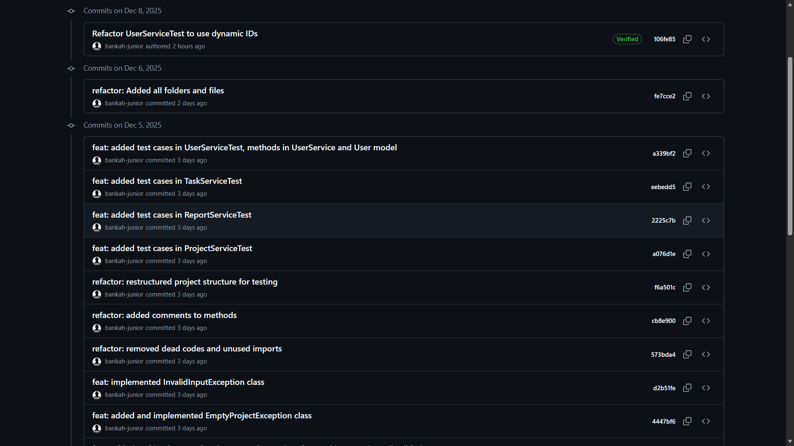

# Task Management System

**Java Console Application (Modern Java, Functional & Concurrent)**

---

## 📌 Overview

The **Task Management System** is a **console-based Java application** designed to demonstrate **core and advanced Java concepts** including **OOP**, **Collections**, **Functional Programming**, **Streams**, **File Persistence**, **Regex Validation**, **Concurrency**, and **JUnit 5 testing**.

The system manages **projects**, **tasks**, and **users**, persists data to JSON files (without a database), and supports **role-based access control** with a clean and extensible architecture.

---

## 🚀 Key Features

### 1️⃣ Project Catalog Management

* Create **Software** and **Hardware** projects
* View all projects with full details
* Filter projects by type
* Search projects by budget range
* Display project completion rate

### 2️⃣ Task Management

* Add, update, and remove tasks
* Assign tasks to users
* Track task status (`TODO`, `IN_PROGRESS`, `COMPLETED`)
* View tasks per project
* Persist tasks across application restarts

### 3️⃣ User Management

* Admin and Regular users
* Role-based access control
* Auto-generated unique user IDs
* Email and role validation using regex
* Persist users to JSON storage

### 4️⃣ Status Reporting & Analytics

* Project completion percentage
* Total, completed, and pending task counts
* Optional per-user task summary
* Streams-based aggregation and filtering

### 5️⃣ File Persistence (No Database)

* JSON-based storage using **Java NIO (`Files`, `Paths`)**
* Data persisted for:

    * Projects
    * Tasks
    * Users
* Auto-load data on application startup
* Auto-save in the background

### 6️⃣ Functional Programming

* Custom functional interfaces
* Lambda expressions
* Method references
* Streams API for filtering, mapping, and reduction
* Functional utility helpers

### 7️⃣ Basic Concurrency

* Background auto-save thread (`Runnable`)
* Thread-safe persistence using `synchronized`
* Graceful shutdown using JVM shutdown hooks
* Non-blocking saves with daemon threads

### 8️⃣ Exception Handling & Validation

* Custom exceptions:

    * `InvalidInputException`
    * `TaskNotFoundException`
    * `EmptyProjectException`
* Regex-based input validation
* Safe error handling with meaningful messages

### 9️⃣ Testing

* JUnit 5 unit tests
* Service-level testing
* Persistence and logic validation
* Ready for concurrency and integration tests

---

## 🧱 Project Structure

```
├── 📁 docs
│   ├── 🖼️ Commit-Logs.png
│   ├── 🖼️ JUnit-Test-Results.png
│   ├── 📄 TaskManagementSystem.drawio
│   └── 🖼️ TaskManagementSystem.png
├── 📁 src
│   ├── 📁 data
│   │   ├── ⚙️ projects_data.json
│   │   ├── ⚙️ tasks_data.json
│   │   └── ⚙️ users_data.json
│   ├── 📁 main
│   │   └── 📁 java
│   │       └── 📁 com
│   │           └── 📁 amalitech
│   │               ├── 📁 concurrency
│   │               │   └── ☕ AutoSaveTask.java
│   │               ├── 📁 interfaces
│   │               │   ├── ☕ Completable.java
│   │               │   └── ☕ TaskFilter.java
│   │               ├── 📁 models
│   │               │   ├── ☕ AdminUser.java
│   │               │   ├── ☕ HardwareProject.java
│   │               │   ├── ☕ Project.java
│   │               │   ├── ☕ RegularUser.java
│   │               │   ├── ☕ SoftwareProject.java
│   │               │   ├── ☕ StatusReport.java
│   │               │   ├── ☕ Task.java
│   │               │   └── ☕ User.java
│   │               ├── 📁 services
│   │               │   ├── ☕ ProjectService.java
│   │               │   ├── ☕ ReportService.java
│   │               │   ├── ☕ TaskService.java
│   │               │   └── ☕ UserService.java
│   │               ├── 📁 utils
│   │               │   ├── 📁 exceptions
│   │               │   │   ├── ☕ EmptyProjectException.java
│   │               │   │   ├── ☕ InvalidInputException.java
│   │               │   │   └── ☕ TaskNotFoundException.java
│   │               │   ├── ☕ ConsoleMenu.java
│   │               │   ├── ☕ FileUtils.java
│   │               │   ├── ☕ FunctionalUtils.java
│   │               │   ├── ☕ RegexValidator.java
│   │               │   ├── ☕ TaskStatus.java
│   │               │   └── ☕ ValidationUtils.java
│   │               └── ☕ Main.java
│   └── 📁 test
│       └── 📁 java
│           └── 📁 com
│               └── 📁 amalitech
│                   ├── 📁 concurrency
│                   │   └── ☕ ConcurrencyTest.java
│                   ├── 📁 functional
│                   │   └── ☕ FunctionalUtilsTest.java
│                   ├── 📁 services
│                   │   ├── ☕ ProjectServiceTest.java
│                   │   ├── ☕ ReportServiceTest.java
│                   │   ├── ☕ TaskServiceTest.java
│                   │   ├── ☕ UserPersistenceTest.java
│                   │   └── ☕ UserServiceTest.java
│                   └── 📁 utils
│                       └── ☕ RegexValidatorTest.java
├── ⚙️ .gitignore
├── 📝 APPROACH_USED.md
├── 📝 README.md
├── 📝 THOUGHT_PROCESS.md
└── ⚙️ pom.xml
```

---

## ⚙️ Setup Instructions

1. **Clone the repository**

   ```bash
   git clone <repository-url>
   ```

2. **Open in an IDE**

    * IntelliJ IDEA (recommended)
    * Eclipse
    * VS Code

3. **Build the project**

   ```bash
   mvn clean install
   ```

4. **Run the application**

   ```bash
   Run Main.java
   ```

---

## 🧭 Usage Guide

### Login

* Select a user ID to log in
* Admins have full access
* Regular users have restricted permissions

### Main Menu

```
1. Manage Projects
2. Manage Tasks
3. View Status Reports
4. Switch User
5. Exit
```

### Exit

* Application performs a **final auto-save**
* Data remains persisted for next startup

---

## 🧪 Testing

### Run Tests

```bash
mvn test
```

### Covered Areas

* Services logic
* Functional utilities
* Persistence behavior
* Report calculations

---

## 🧠 Design Principles Used

* Object-Oriented Programming (OOP)
* SOLID principles
* Separation of concerns
* Functional programming
* Thread safety
* Clean architecture
* Javadoc-only documentation

---

## 📈 Future Enhancements

* ExecutorService-based concurrency
* Advanced analytics dashboard
* JSON parsing using libraries (Jackson/Gson)
* REST API layer (Spring Boot)
* Database integration

---

## 📄 License

This project is for **educational and demonstration purposes**.

--- 

## JUnit Test 

### Steps 
    1. Navigate into the test folder. 
    2. Right-click on the java folder. 
    3. Click on Run All Tests 

### Results  

## Git Commit Logs 

### Screenshot of some git commit logs 
